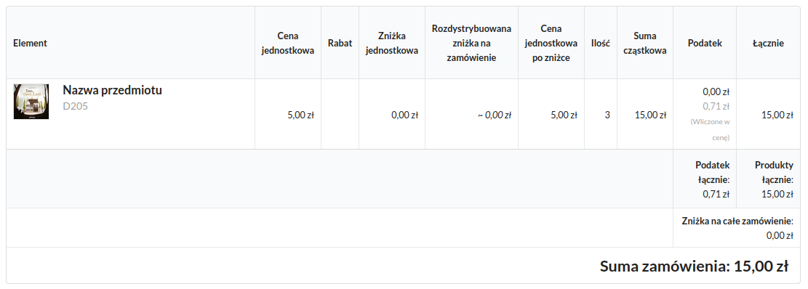

# GWO zadanie rekrutacyjne

## Uruchomienie projektu

1. Zadanie wymaga posiadania zainstalowanego środowiska Docker (albo Docker Desktop) 
2. Polecenie `make start` pozwoli uruchomić cały stack
3. Otwórz `https://localhost` w przeglądarce i zaakceptuje automatycznie wygenerowany certyfikat TLS
4. Polecenie `make down` zatrzymuje Dockera

Więcej poleceń znajduje się w pliku `Makefile`

## Zadanie do wykonania

### Wprowadzenie

1. Sklonuj repozytorium i wypchnij je na swoje prywatne repozytorium w serwisie Github (albo GitLab). Jeśli nie masz kont w tych serwisach, możesz przesłać nam swój kod spakowany (razem z folderem .git)
2. Nad każdym zadaniem pracuj według jednego flow, który sam ustalisz. Przykładowo:
- stwórz feature branch
- zaimplementuj rozwiązanie
- stwórz pull request (merge request) – dotyczy pracy przy Github (GitLab)
- zamknij pull request (merge request) – dotyczy pracy przy Github (GitLab)
- zacznij kolejne zadanie
3. Po zakończeniu prac nadaj uprawnienia do swojego repozytorium osobom wskazanym w e-mailu rekrutacyjnym albo prześlij swój kod na adres rekrutacja@gwo.pl

### Treść zadania

1. Napisz endpoint, który pozwoli dodać produkt do koszyka. Zrób ograniczenie na minimalną i maksymalną liczbę sztuk produktów, które znajdują się w koszyku. Dodaj też ograniczenie, aby w koszyku nie było więcej niż 5 różnych produktów. Dodanie tego samego produktu do koszyka powinno zwiększać jego liczbę sztuk.

 
2. Zaimplementuj mechanizm promocji. Do koszyka można dodać promocje per typ produktu (szczegóły poniżej), która obniża wartość każdej sztuki produktu o określony procent oraz promocje na całe zamówienie, która obniża wartość całego koszyka o określony procent. Stwórz funkcjonalność, która umożliwi wyświetlić następującą tabelkę z podsumowaniem (widok poglądowy)

* dodaj stosowne migracje, które pozwolą przechować dodatkowe informacje o naliczeniu promocji koszyku,
* stwórz endpoint, który pozwoli przypisać promocję o zadanym ID (`bookshop_promotion`) do stworzonego zamówienia,
* dodaj endpoint, który pobierze informacje o zamówieniu i wyświetli dane z tabelki w formacie podanym w [specyfikacji](.misc/docs/contract.yaml).

3. Zadanie dodatkowe - zaimplementuj możliwość reprezentowania (wyświetlania) kwot w zamówieniu w walucie PLN i EUR; dodaj mechanizm przeliczenia wartości zamówienia i cen przedmiotów w odpowiedniej walucie po kursie zdefiniowanym w stałej; w endpoincie z punktu 2, który umożliwia pobieranie szczegółów zamówienia, dodaj parametr z wybraną walutą (`PLN` albo `EUR`) na podstawie którego zostaną zwrócone odpowiednie dane.

### Dodatkowe informacje

1. koszyk powinien operować na groszach – żeby uniknąć błędów operacji zmiennoprzecinkowych
2. stworzone endpointy powinny posiadać dokumentację w Openapi 3.0.x
3. architektura rozwiązania jest także istotna (struktura projektu oraz klasy mają charakter przykładowy)
4. napisz testy klas (unit testy) oraz testy funkcjonalne, które odpowiadają regułom biznesowym
5. plik z opisem tabel w bazie danych znajdziesz [tutaj](.misc/docs/index.md)

### Szczegóły działania mechanizmu promocji

1. jeden przedmiot może mieć przypisaną tylko i wyłącznie jedną tę samą promocję (o typie `1`)
2. do całego zamówienia można dodać tylko jedną promocję na zamówienie (o typie `2`) 
3. mechanizm aplikujący promocję na przedmiot powinien ją zaaplikować tylko do tych produktów, których typ jest zgodny z typem ustawionym w kolumnie `product_types_filter`; czyli promocja na produkty o typie `BOOK` powinna zostać zaaplikowana do przedmiotu tylko wtedy, gdy zakupiony produkt jest typem `BOOK`. W przeciwnym wypadku promocja nie powinna zostać zaaplikowana.
4. obliczenia powinny najpierw uwzględniać promocje na przedmioty (zgodnie z kolejnością ich dodania), a następnie promocję na całe zamówienie

### Scenariusz testowy

Część funkcjonalna zostanie przetestowana w następujący sposób:

1. wygenerowane zostaną produkty o różnej cenie, stawce podatkowej oraz typie
2. wygenerowane zostaną promocje o różnej wartości procentowej zniżki i filtrach typów produktów
3. przy użyciu endpointu z zadania nr 1 zostaną dodane różne produkty albo produkt do koszyka
4. przy użyciu endpointów z zadania nr 2 zostaną zaaplikowane różne promocje i pobrane informacje o zamówieniu (weryfikowana będzie kompletność informacji oraz poprawność obliczeń)
5. opcjonalnie przy użyciu modyfikacji endpointu z zadania nr 3 zostaną pobrane szczegóły zamówienia i zweryfikowana poprawność obliczeń
